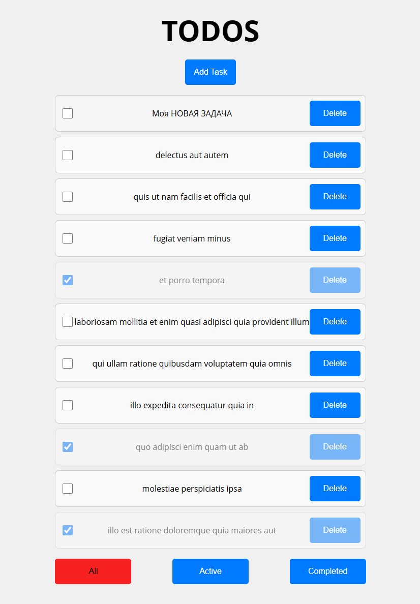

# ToDoList(3 pages)ReactRedux

## Cтек: TypeScript, React, Redux, React Router
- Главная страница, отображает список дел с Api, позволяет менять статус задачи с помощью чекбокса, на кнопках внизу настроена фильтрация задач(все, выполенные, не выполенные), кнопка Delete удаляет задачу, нажатием на таску мы переходим на страницу 3, нажатием на кнопку AddTask переходим на страницу 2.
- 2 Страница (addTask), позволяет добавлять новую задачу с помощью кнопки SaveTask или Enter (пустую задачу добавить нельзя)
- 3 Страница (tasks), показывает детальную информацию о задаче(id, titile, status), нажатием на Title можно отредактировать задачу, нажатием на кнопки можно менять статус задачи(выполнено, не выполнено) или вернуться на главную страницу

### Инструкция по запуску
- Создайте папку для проекта и перейдите в неё.
- Склонируйте репозиторий `git clone git@github.com:AplusO1/ReactReduxTS-3-Pages-.git`
- Установите зависимости `npm install`
- Запускайте проект `npm run dev`
- Запустить линтер `npm run lint`
---
